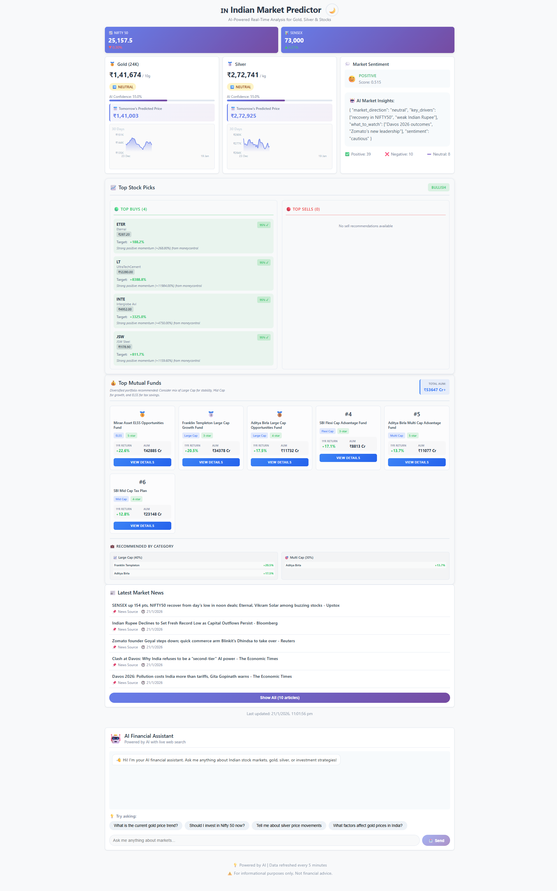
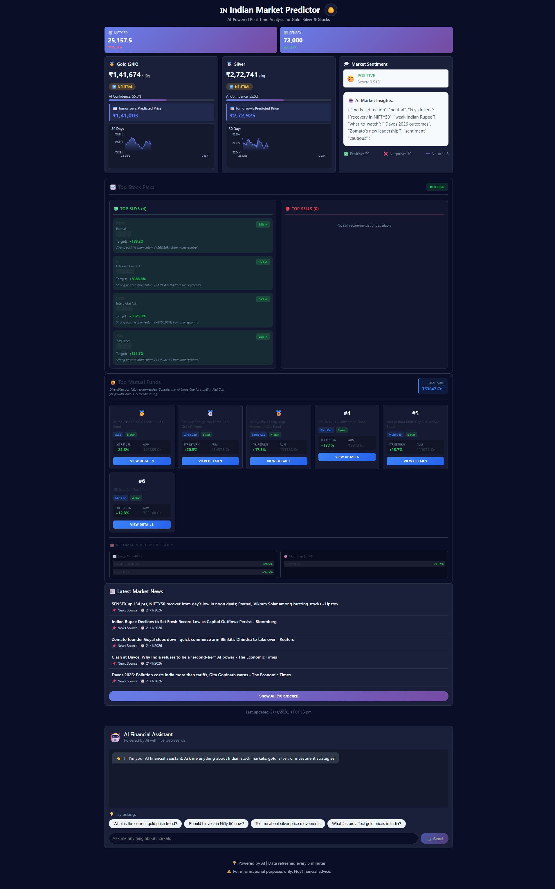

# 🇮🇳 Indian Market Predictor

> AI-Powered Real-Time Analysis Platform for Gold, Silver & Stocks in the Indian Market

<div align="center">

### 🎨 UI Theme Preview

<details>
<summary><b>☀️ View Light Mode Preview</b> (Click to expand)</summary>
<br>

</details>

<details>
<summary><b>🌙 View Dark Mode Preview</b> (Click to expand)</summary>
<br>

</details>

[](https://www.python.org/)
[](https://reactjs.org/)
[](https://fastapi.tiangolo.com/)
[](LICENSE)

</div>

---

## 📋 Table of Contents

- [Overview](#-overview)
- [Features](#-features)
- [Technology Stack](#-technology-stack)
- [Prerequisites](#-prerequisites)
- [Setup Instructions](#-setup-instructions)
  - [Backend Setup](#backend-setup)
  - [Frontend Setup](#frontend-setup)
- [Running the Application](#-running-the-application)
- [API Endpoints](#-api-endpoints)
- [Project Structure](#-project-structure)
- [Configuration](#-configuration)
- [Troubleshooting](#-troubleshooting)

---

## 🎯 Overview

**Indian Market Predictor** is a comprehensive AI-powered financial analysis platform designed specifically for the Indian market. It provides real-time insights, predictions, and recommendations for:

- **Gold & Silver Prices** - Live rates with AI-powered price predictions
- **Stock Market Indices** - NIFTY 50 and SENSEX tracking with trend analysis
- **Individual Stocks** - Top buy/sell recommendations based on real-time data
- **Market Sentiment** - AI-generated insights from news and market trends

### Technical Overview

The platform consists of two main components:

1. **Backend (FastAPI)** - RESTful API that:
   - Scrapes real-time data from multiple sources (Moneycontrol, Yahoo Finance, etc.)
   - Processes market data using technical indicators (RSI, MA, MACD, Bollinger Bands)
   - Generates AI-powered predictions using free AI services (Groq, Gemini, Hugging Face)
   - Performs sentiment analysis on financial news
   - Provides intelligent stock recommendations

2. **Frontend (React)** - Modern, responsive web interface with:
   - Dark/Light mode toggle
   - Real-time dashboard with live charts
   - Interactive stock cards with clickable links
   - AI-powered chatbot for market queries
   - News aggregation panel

### Visual Overview

The application features a beautiful, modern UI with:
- **Dashboard Cards** for Gold, Silver, NIFTY, and SENSEX
- **Interactive Charts** showing price history and predictions
- **Stock Recommendations** with buy/sell picks and confidence scores
- **Market Sentiment** analysis with AI insights
- **News Panel** displaying relevant financial news
- **Chatbot Interface** for interactive market queries

Use the toggle buttons above to preview both Light and Dark mode themes! 🌙☀️

---

## ✨ Features

### Real-Time Market Data
- ✅ Live Gold and Silver prices (₹/10g and ₹/kg)
- ✅ Real-time NIFTY 50 and SENSEX indices
- ✅ Trending stocks from Moneycontrol
- ✅ Auto-refresh every 5 minutes

### AI-Powered Analysis
- ✅ Price predictions using machine learning
- ✅ Market sentiment analysis from news
- ✅ Stock recommendations (Top Buys/Sells)
- ✅ Technical indicator analysis (RSI, MA, MACD, Bollinger Bands)
- ✅ AI-generated market insights

### User Interface
- ✅ Dark/Light mode toggle
- ✅ Responsive design (mobile-friendly)
- ✅ Interactive price charts
- ✅ Clickable stock links to Moneycontrol
- ✅ Real-time data updates
- ✅ Loading states and error handling

### Additional Features
- ✅ News aggregation from multiple sources
- ✅ AI Chatbot for market queries
- ✅ Top mutual fund recommendations
- ✅ Historical price analysis
- ✅ Backtesting capabilities

---

## 🛠 Technology Stack

### Backend
- **FastAPI** - Modern, fast web framework for building APIs
- **Python 3.11+** - Core programming language
- **Pandas** - Data manipulation and analysis
- **NumPy** - Numerical computing
- **scikit-learn** - Machine learning algorithms
- **BeautifulSoup4** - Web scraping
- **aiohttp** - Asynchronous HTTP client
- **uvicorn** - ASGI server

### Frontend
- **React 18.2** - UI library
- **Recharts** - Charting library for visualizations
- **Axios** - HTTP client for API calls
- **CSS3** - Styling with custom themes

### AI Integration (All FREE)
- **Groq API** - Llama 3.3 70B model (30 req/min, no credit card)
- **Google Gemini** - Gemini 2.0 Flash (1500 req/day, no credit card)
- **Hugging Face** - Mixtral 8x7B (300 req/hour)

### Data Sources
- Moneycontrol - Stock prices and trending stocks
- Yahoo Finance - Historical data and indices
- GoldPrice.org - Precious metal prices
- RSS Feeds - Financial news aggregation

---

## 📦 Prerequisites

Before you begin, ensure you have the following installed:

- **Python 3.11+** - [Download here](https://www.python.org/downloads/)
- **Node.js 16+ and npm** - [Download here](https://nodejs.org/)
- **Git** - [Download here](https://git-scm.com/downloads)

Optional but recommended:
- **API Keys** (for enhanced AI features):
  - Groq API Key: [Get free key](https://console.groq.com/)
  - Google Gemini API Key: [Get free key](https://makersuite.google.com/app/apikey)
  - Hugging Face API Key: [Get free key](https://huggingface.co/settings/tokens)

---

## 🚀 Setup Instructions

### Backend Setup

1. **Navigate to backend directory:**
   ```bash
   cd backend
   ```

2. **Create a virtual environment (recommended):**
   ```bash
   # Windows
   python -m venv venv
   venv\Scripts\activate

   # Linux/Mac
   python3 -m venv venv
   source venv/bin/activate
   ```

3. **Install dependencies:**
   ```bash
   pip install -r requirements.txt
   ```

4. **Create environment file:**
   ```bash
   # Create a .env file in the backend directory
   # Windows
   type nul > .env

   # Linux/Mac
   touch .env
   ```

5. **Configure environment variables:**
   Open `.env` and add your API keys (optional but recommended):
   ```env
   # AI Provider (groq, gemini, or huggingface)
   AI_PROVIDER=groq

   # Groq API Key (Free - 30 req/min)
   GROQ_API_KEY=your_groq_api_key_here

   # Google Gemini API Key (Free - 1500 req/day)
   GEMINI_API_KEY=your_gemini_api_key_here

   # Hugging Face API Key (Free - 300 req/hour)
   HUGGINGFACE_API_KEY=your_hf_api_key_here

   # Server Configuration (optional)
   HOST=0.0.0.0
   PORT=8000
   DEBUG=True

   # CORS (optional)
   CORS_ORIGINS=http://localhost:3000
   ```

   **Note:** The application works without API keys using fallback analysis, but AI features will be limited.

### Frontend Setup

1. **Navigate to frontend directory:**
   ```bash
   cd frontend
   ```

2. **Install dependencies:**
   ```bash
   npm install
   ```

3. **Configure API URL (if needed):**
   Create a `.env` file in the frontend directory:
   ```env
   REACT_APP_API_URL=http://localhost:8000
   ```

   The frontend is already configured to proxy to `http://localhost:8000` in `package.json`, so this step is usually optional.

---

## 🏃 Running the Application

### Start Backend Server

1. **Activate virtual environment (if using):**
   ```bash
   # Windows
   venv\Scripts\activate

   # Linux/Mac
   source venv/bin/activate
   ```

2. **Navigate to backend directory:**
   ```bash
   cd backend
   ```

3. **Start the FastAPI server:**
   ```bash
   uvicorn app.main:app --reload --host 0.0.0.0 --port 8000
   ```

   The API will be available at: **http://localhost:8000**
   
   API documentation:
   - Swagger UI: http://localhost:8000/docs
   - ReDoc: http://localhost:8000/redoc

### Start Frontend Development Server

1. **Navigate to frontend directory:**
   ```bash
   cd frontend
   ```

2. **Start the React development server:**
   ```bash
   npm start
   ```

   The application will automatically open in your browser at: **http://localhost:3000**

### Using Docker (Alternative)

If you prefer Docker:

1. **Build and run with Docker Compose:**
   ```bash
   docker-compose up --build
   ```

   This will start both backend and frontend containers automatically.

---

## 📡 API Endpoints

### Main Endpoints

| Endpoint | Method | Description |
|----------|--------|-------------|
| `/dashboard` | GET | Get complete dashboard data (gold, silver, stocks, sentiment, news) |
| `/gold/analysis` | GET | Get detailed gold price analysis with predictions |
| `/silver/analysis` | GET | Get detailed silver price analysis with predictions |
| `/stock/{symbol}/analysis` | GET | Get analysis for a specific stock (e.g., `/stock/RELIANCE.NS/analysis`) |
| `/market/overview` | GET | Get market overview (NIFTY, SENSEX, gold, sentiment) |
| `/chatbot` | POST | Query the AI chatbot about market conditions |

### Example API Call

```bash
# Get dashboard data
curl http://localhost:8000/dashboard

# Chatbot query
curl -X POST http://localhost:8000/chatbot \
  -H "Content-Type: application/json" \
  -d '{"question": "What is the current gold price in India?"}'
```

---

## 📁 Project Structure

```
indian-market-predictor/
│
├── backend/
│   ├── app/
│   │   ├── main.py                 # FastAPI application entry point
│   │   ├── config.py               # Configuration settings
│   │   ├── models/
│   │   │   └── schemas.py          # Pydantic models/schemas
│   │   ├── services/
│   │   │   ├── ai_service.py       # AI integration (Groq, Gemini, HF)
│   │   │   ├── gold_service.py     # Gold price fetching & analysis
│   │   │   ├── silver_service.py   # Silver price fetching & analysis
│   │   │   ├── stock_service.py    # Stock data & technical analysis
│   │   │   ├── stock_scraper.py    # Web scraping for stocks
│   │   │   ├── stock_recommendations.py  # Buy/sell recommendations
│   │   │   ├── news_service.py     # News aggregation & sentiment
│   │   │   ├── chatbot_service.py  # AI chatbot logic
│   │   │   └── cache_service.py    # Caching layer
│   │   └── analysis/
│   │       ├── indicators.py       # Technical indicators (RSI, MA, etc.)
│   │       ├── predictor.py        # Price prediction models
│   │       ├── sentiment.py        # Sentiment analysis
│   │       └── backtesting.py      # Backtesting functionality
│   ├── requirements.txt            # Python dependencies
│   ├── Dockerfile                  # Docker configuration
│   ├── test_dashboard.py          # Dashboard endpoint tests
│   └── test_scraping.py           # Scraping functionality tests
│
├── frontend/
│   ├── src/
│   │   ├── App.js                  # Main React component
│   │   ├── App.css                 # Global styles
│   │   ├── index.js                # React entry point
│   │   ├── components/
│   │   │   ├── Dashboard.js        # Main dashboard component
│   │   │   ├── GoldCard.js         # Gold price card
│   │   │   ├── SilverCard.js       # Silver price card
│   │   │   ├── StockCard.js        # Stock index cards
│   │   │   ├── TopStocks.js        # Stock recommendations
│   │   │   ├── MarketSentiment.js  # Market sentiment display
│   │   │   ├── NewsPanel.js        # News aggregation
│   │   │   ├── Chatbot.js          # AI chatbot interface
│   │   │   ├── PriceChart.js       # Price charts
│   │   │   └── ...                 # Other components
│   │   └── services/
│   │       └── api.js              # API client
│   ├── package.json                # Node dependencies
│   ├── Dockerfile                  # Frontend Docker config
│   └── config-overrides.js         # Webpack configuration
│
├── docker-compose.yml              # Docker Compose configuration
├── README.md                       # This file
├── Light_mode.png                  # Light mode screenshot
└── Dark_mode.png                   # Dark mode screenshot
```

---

## ⚙️ Configuration

### AI Provider Selection

The application supports three free AI providers. Configure in `backend/.env`:

```env
AI_PROVIDER=groq  # Options: groq, gemini, huggingface
```

**Provider Comparison:**

| Provider | Free Tier | Best For |
|----------|-----------|----------|
| Groq | 30 req/min | Fast responses, high quality |
| Gemini | 1500 req/day | Daily usage, reliable |
| Hugging Face | 300 req/hour | Open-source models |

### Fallback Mode

If no API keys are provided, the application uses intelligent rule-based fallback analysis. This ensures the app works even without AI integration, though with reduced functionality.

---

## 🔧 Troubleshooting

### Backend Issues

**Problem:** `ModuleNotFoundError`  
**Solution:** Make sure virtual environment is activated and dependencies are installed:
```bash
pip install -r requirements.txt
```

**Problem:** `Port 8000 already in use`  
**Solution:** Change the port in `.env` or kill the process using port 8000:
```bash
# Windows
netstat -ano | findstr :8000
taskkill /PID <PID> /F

# Linux/Mac
lsof -ti:8000 | xargs kill
```

**Problem:** API errors with scraping  
**Solution:** The application has multiple fallback data sources. Check your internet connection and try again. The app will automatically use fallback data if scraping fails.

### Frontend Issues

**Problem:** `npm install` fails  
**Solution:** Clear cache and try again:
```bash
npm cache clean --force
rm -rf node_modules package-lock.json
npm install
```

**Problem:** CORS errors  
**Solution:** Make sure backend is running on port 8000 and CORS is configured in `backend/app/config.py`

**Problem:** Can't connect to API  
**Solution:** Verify backend is running and check `REACT_APP_API_URL` in frontend `.env`

### General Issues

**Problem:** No data showing  
**Solution:** 
1. Check browser console for errors
2. Verify backend is running: `curl http://localhost:8000/dashboard`
3. Check network tab in browser DevTools

**Problem:** AI features not working  
**Solution:** Verify API keys in `.env` file. The app works in fallback mode without keys.

---

## 📊 Testing

### Test Backend

```bash
cd backend

# Test dashboard endpoint
python test_dashboard.py

# Test scraping functionality
python test_scraping.py
```

### Test Frontend

```bash
cd frontend
npm test
```

---

## 🎨 Features Showcase

### Dashboard Features
- **Real-time Price Cards** - Live updates for Gold, Silver, NIFTY, SENSEX
- **Interactive Charts** - 30-day price history with predictions
- **AI Predictions** - Tomorrow's price predictions with confidence scores
- **Technical Indicators** - RSI, Moving Averages, MACD, Bollinger Bands

### Stock Recommendations
- **Top Buys** - Stocks with positive momentum and high confidence
- **Top Sells** - Stocks to consider profit booking or avoiding
- **Clickable Links** - Direct links to Moneycontrol for detailed analysis
- **Confidence Scores** - AI-generated confidence percentages

### Market Insights
- **Sentiment Analysis** - Overall market sentiment (Positive/Negative/Neutral)
- **AI Insights** - AI-generated market commentary
- **News Aggregation** - Relevant financial news from multiple sources
- **Chatbot** - Ask questions about market conditions

---

## 🤝 Contributing

Contributions are welcome! Please feel free to submit a Pull Request.

---

## 📝 License

This project is licensed under the MIT License - see the [LICENSE](LICENSE) file for details.

---

## 🙏 Acknowledgments

- **Data Sources**: Moneycontrol, Yahoo Finance, GoldPrice.org
- **AI Providers**: Groq, Google Gemini, Hugging Face
- **Icons & Emojis**: Used for visual enhancement

---

## 📞 Support

For issues, questions, or contributions:
- Open an issue on GitHub
- Check the troubleshooting section above
- Review API documentation at `/docs` endpoint

---

<div align="center">

**Built with ❤️ for the Indian Market**

⭐ Star this repo if you find it useful!

</div>